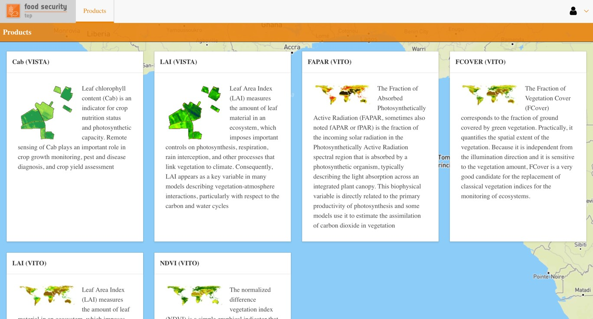
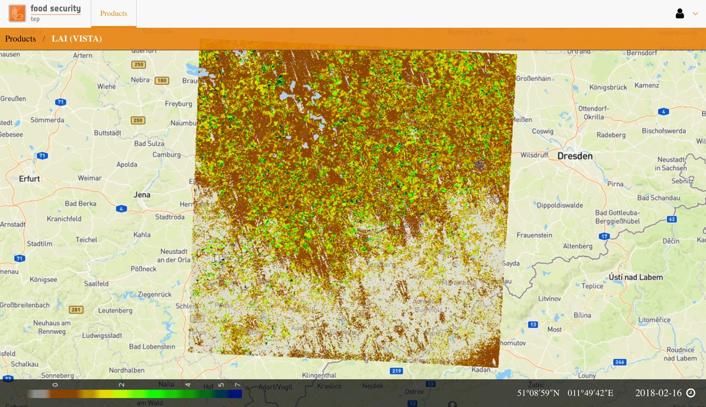
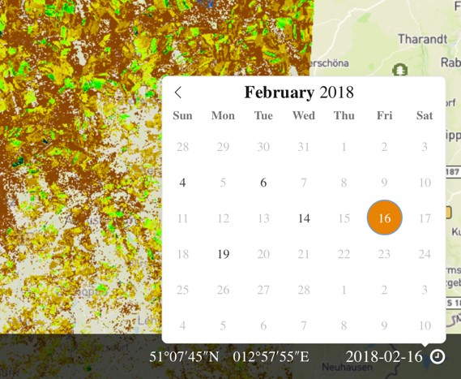
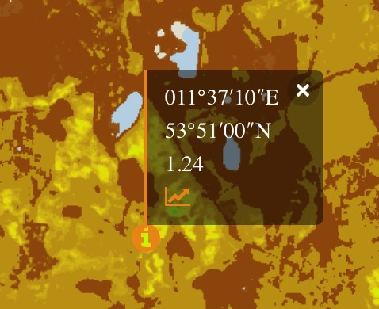
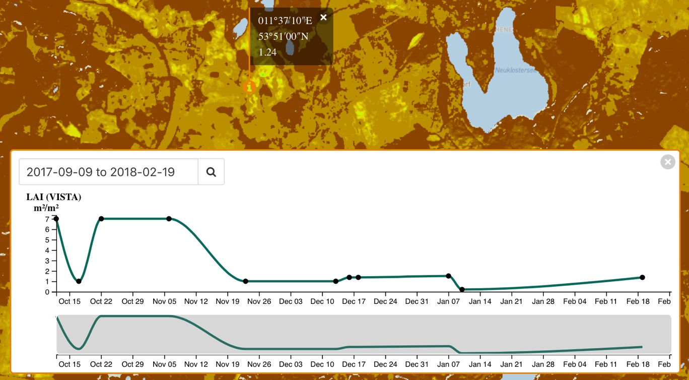

.. _analyst_view:

Analyst View
============

About the Analyst View
----------------------

Selecting the “Analyst” tab on the FS TEP portal will open up the analyst view in a new browser tab.  The analyst view can also be accessed directly at

.. centered::

https://foodsecurity-tep.net/analyst/

This view allows users to browse and view selected output product sets in an easy to use and mobile compatible interface, without the need to have sharing rights or TEP coins. However downloading products from this view is not permitted.

Using the Analyst View
----------------------

Click on “Products” to see a list of available data products, together with short descriptions.

    
Selecting a product will automatically open the most recent date for this product, and will zoom in to the appropriate area of interest.

To navigate the product:

* Zoom in by double clicking or scrolling the mounse
* Zoom out by pressing shift and double clicking

To view the product for a different date, click on the date shown in the bottom right to get a pop up calendar.

Dates where data are present are shown in black, dates without data are in grey.

Clicking on any point will show a pop up giving the latitude and longitude of the point, and the value of the product on the selected date.

Clicking on the graph symbol shows a time series for the product for the available dates, with dots showing when data are available and a line interpolating these data points.

    