.. _exploring_data_services:

Exploring Data and Services
===========================

The Explorer tab
----------------
The explorer tab allows users to search for data and for available services, then to select a service to be run on the data. The figure below shows an overview of the explorer tab.

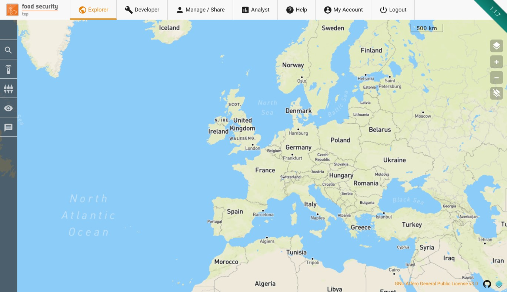
    
Down the left hand side is a menu containing the following symbols

|Search| Brings up a panel allowing users to search for data. This can be satellite data, reference data or products already processed on the FS TEP. See :ref:`searching_for_data`.

.. |Services| image:: images/symbol-services.jpg 
              :scale: 50% 

|Services| Brings up a panel allowing user to search for available services that can be run on the data. See :ref:`using_services`.

|Workspace| Brings up a panel showing the workspace (control panel) for the selected service. See :ref:`screenshot <workspace>`.

|Data| Brings up the data panel (see below), allowing a user to see key information. If the panel is already visible  then pressing this symbol will hide it.

.. |Messages| image:: images/symbol-messages.jpg 
              :scale: 50%   

|Messages| Shows a count of the number of unread messages. Clicking on it will open the data panel at the messages tab.

At the bottom of the explorer tab the **data panel** can be made to appear. This shows the user

* Results of data searches, as described in :ref:`searching_for_data`.
* Databaskets, as described in section :ref:`using_databaskets`.
* Status of jobs, as described in section :ref:`using_jobs`.
* System messages to the user.

The data panel can be closed by clicking on the “Close” button in the top right, or can be expanded by clicking on the “Expand Button”.

The remainder of the explorer tab shows the geobrowser, which can be used to select areas, to see product footprints and to view previews of some types of products.

.. _searching_for_data:

Searching for data
------------------

Search Panel Overview
^^^^^^^^^^^^^^^^^^^^^
Selecting the *Search panel* in the Explorer tab allows users to browse the data contained in FS TEP.

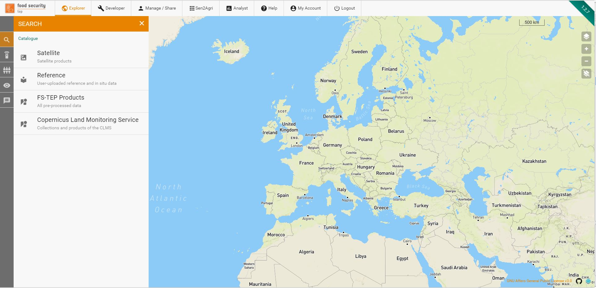

This is divided into four groups:

* **Satellite data**, containing the various satellite data available to all users
* **Reference data**, containing reference and in situ data uploaded by users of the platform
* **FS TEP products**, containing outputs of services already run on the FS TEP platform.
* **Copernicus Land Monitoring Service**, containing all the collections available in the Copernicus Land Monitoring Service, to which the FS TEP is connected.

Satellite data and Copernicus Land Monitoring Service are visible to all users, but reference data and FS TEP products are only visible if the owner has chosen to share them: see :ref:`managing_and_sharing` for more details on sharing.

Searching for Satellite Data
^^^^^^^^^^^^^^^^^^^^^^^^^^^^  

Satellite data can be searched for using the following parameters:

1. **Collection** – the top level grouping by satellite (Sentinel-1, Sentinel-2, etc.)
2. **Product date** (optional) – the acquisition date of the product.
3. **AOI** – this can be drawn directly on the geobrowser (as box or polygon), or using a previously saved are, or by importing a shapefile.
4. **Identifier** (optional) – a string identifying the product

Depending on the satellite chosen, some of the following parameters will also appear:

5. **Platform** – select individual spacecraft within an overall platform.
6. **Product type** – a menu whose entries depends on the satellite chosen.
7. **Orbit direction** – ascending or descending, or leave blank for both.
8. **Cloud coverage** – maximum cloud coverage for optical imagery.

Satellite products are visible to all users by default.

.. _searching_for_reference_data:

Searching for Reference Data
^^^^^^^^^^^^^^^^^^^^^^^^^^^^

Reference data includes user uploaded reference and in situ data. These can be searched according to the following criteria:

1. **Owner** – the SSO ID of the owner of the product. Leave blank if not known.
2. **Product date** (optional) – the date at which the data is valid, e.g. the measurement data for an in situ measurement.
3. **Publication date** (optional) – the date when this data was uploaded to the FSTEP platform.
4. **AOI** - this can be drawn directly on the geobrowser (as box or polygon), or using a previously saved are, or by importing a shapefile.
5. **Identifier** (optional) – a string identifying the product

Note that only data which have been made visible by their owner will appear in the search.

Searching for FS TEP products
^^^^^^^^^^^^^^^^^^^^^^^^^^^^^
These are products which have already been processed on the FS TEP platform. They can be searched for according to the following criteria:

1. **Collection** – the collection in which the outputs have been grouped. This appears as a drop down menu with a default value of the top level collection of all FSTEP outputs.
2. **Owner** – the SSO ID of the owner of the product. Leave blank if not known.
3. **Product date** (optional) – the date at which the data is valid, e.g. the measurement data for an in situ measurement.
4. **Job date** (optional) – the date when this data was processed by the FSTEP platform.
5. **AOI** - this can be drawn directly on the geobrowser (as box or polygon), or using a previously saved are, or by importing a shapefile.
6. **Identifier** (optional) – a string identifying the product

Note that only products which have been made visible by their owner will appear in the search.

Searching for Copernicus Land Monitoring Service
^^^^^^^^^^^^^^^^^^^^^^^^^^^^^^^^^^^^^^^^^^^^^^^^

These are products available on the `Copernicus Land Monitoring Service <https://land.copernicus.vgt.vito.be/>`_ (CLMS). They can be searched for according to the following criteria:

1. **Collection** – the collection in which the products have been grouped. This appears as a drop down menu with all the CLMS collections. 
2. **Product date** (optional) – the date at which the data is valid, e.g. the measurement data for an in situ measurement.
3. **AOI** - this can be drawn directly on the geobrowser (as box or polygon), or using a previously saved are, or by importing a shapefile. Note: The AOI will be converted to a bounding box that will be used for subsetting the CLMS product.
4. **Identifier** (optional) – a string identifying the product

Viewing Search Results
^^^^^^^^^^^^^^^^^^^^^^

An example search for Sentinel 2 data is shown below.

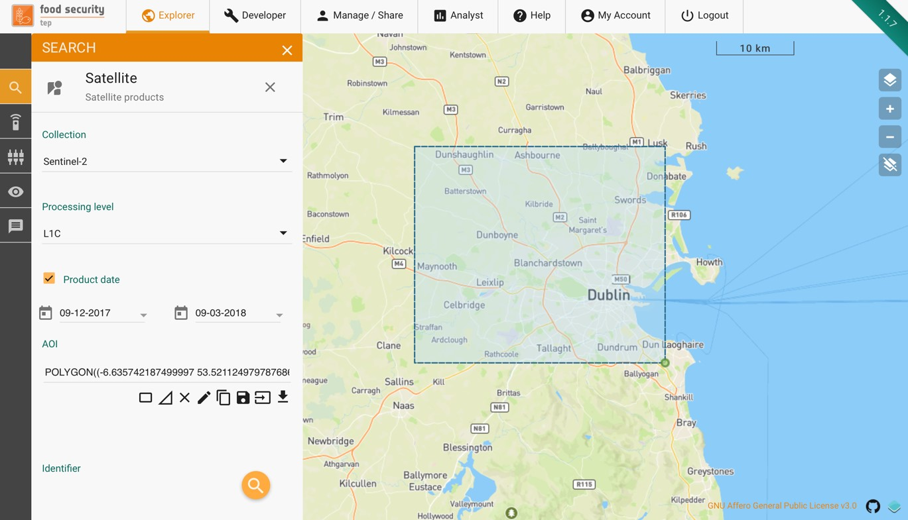

              
Once the criteria have been set, clicking on the |Search-Icon| symbol will start the search. The results will be shown in the data panel as shown below. Selecting a product in the list will highlight its footprint in the geobrowser. 

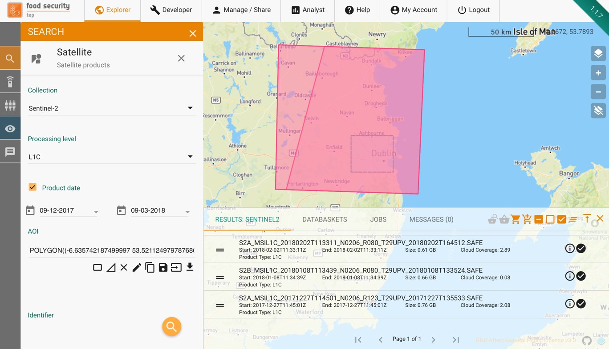

The outputs of a search can be used directly as inputs to a service (see :ref:`using_services`), or else they can be added to a *databasket*, as described in the next section.

.. _using_databaskets:

Using Databaskets
-----------------

A databasket is a collection of products, usually from a search result. They allow results to be grouped for processing together of for sharing with other users.

Databaskets can be created directly from the outputs of a search result, using the following symbols along the top of the data panel:

|Databasket_addall| Adds all search results to the selected databasket

|Databasket_add| Adds only the selected items to the selected databasket

|Databasket_select| Allows a user to select one of the existing databaskets

|Databasket_create| Creates a new databasket, as shown in the figure below

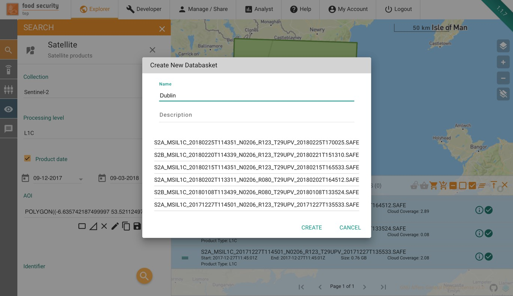

Databaskets can be managed from the **databasket** tab of the data panel. By selecting the appropriate symbol the user can:

|Databasket_create| Add a new databasket

|Databasket_clear| Clear all products in a databasket

|Edit| Edit the name and description of a databasket

.. |Share| image:: images/symbol-share.jpg 
              :scale: 50%   

|Share| Share a databasket - see :ref:`managing_and_sharing_databaskets`

|Copy| Creates a new copy of a databasket

|Show| Show the product footprints on the geobrowser map

|Open| Open the databasket in the manage/share interface - see :ref:`managing_and_sharing_databaskets`

The user can also double click on a databasket to see a list of the products in that databasket, and to remove individual products, as in the figure below:

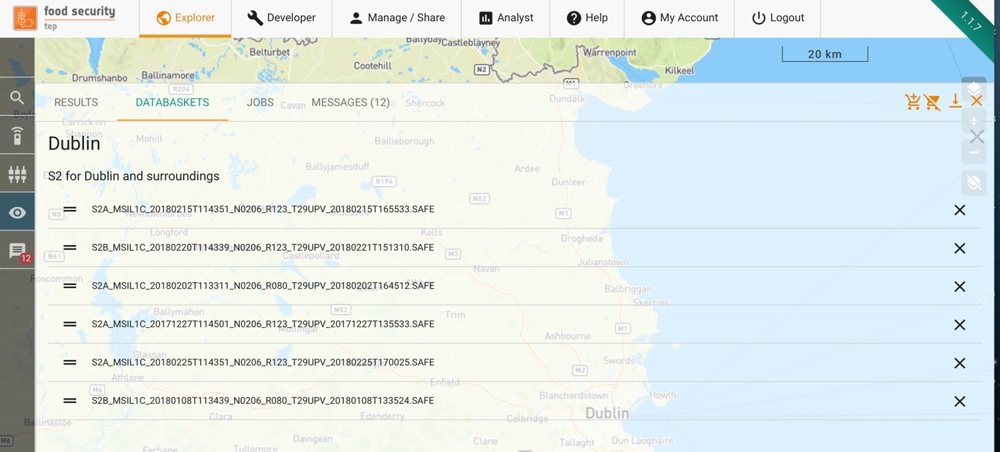

.. _using_services:

Using Services
--------------

Searching for a Service
^^^^^^^^^^^^^^^^^^^^^^^

To search for available services, click on the |Services| symbol on the left hand menu of the explorer tab. 
This will give a list of all of the services that the user has access to, both their own or those that have been shared by other users, as shown below.

.. image:: images/Explorer-07.jpg
    :scale: 50%
    
Services are processes that can be run on selected data, as described below There are also services which represent toolboxes 
that can be run on the data; these behave slightly differently and are described in :ref:`using_applications`.

Running a Service
^^^^^^^^^^^^^^^^^

To run a service, click on the chosen service in the menu.

.. image:: images/Explorer-08.jpg
    :scale: 50%

.. _workspace:

This brings up the workspace for the service, showing the  input parameters required for the service.

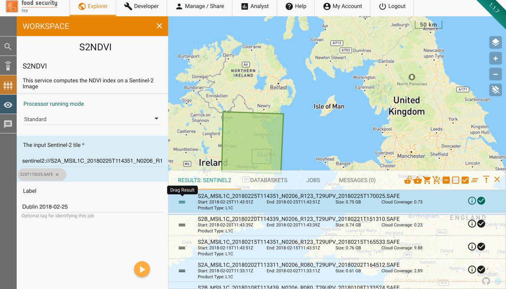

The input parameters required will vary from service to service, but there are some common features:

* Processors can be run in two modes: **standard** or **systematic**. Most users will just require standard processing I.e. processing of one or more products in a single processing run. 
* For advanced users, systematic processing is described in :ref:`using_systematic_processing`.
* Input data products (e.g. a sentinel-2 tile in the example above) can be dragged and dropped from the search results menu using the = symbol. Instead of single tiles, users can add multiple tiles or a databasket, in order to process multiple products in parallel. (See also :ref:`using_services`)
* Some processors are configured to work as parallel processors, generating subjobs as required (even if only one input).
* Some services require additional reference data, which can be either uploaded by the user or else searched for as described in :ref:`searching_for_reference_data`.
* Each job should be given a label to allow it to be identified.

Once all input fields have been completed the job is started by pressing on the arrow. The user will then see a message like this:

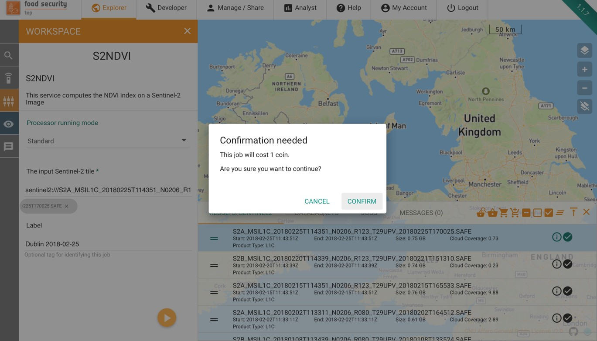

Pressing “Confirm” will cause the job to start and the users coin balance to be debited by the amount stated. The progress of the job can then be monitored as described in :ref:`using_jobs`.

If a user does not have sufficient coin balance then the job will be rejected. See :ref:`my_account_use_tep_coins` for more details and how to request coins.

Note that where multiple (N) products have been input, the number of coins required will be N times the costs of a single product.

.. _using_jobs:

Using Jobs
-------------

Once launched, jobs can be tracked from the “Jobs” section of the data panel, as in the example below.

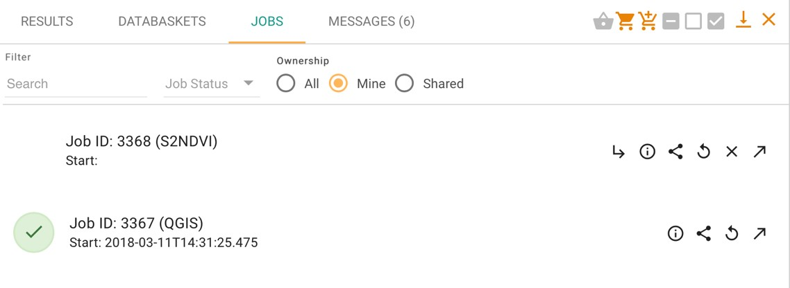

This lists the user’s current and past jobs, and allows the user to:

* See basic information and job status about the job
* Share the job
* Edit and rerun the job (i.e. to revise the parameters then to restart a new job with these modified parameters)
* Open the job in the manage/share interface
* Cancel the job

Double clicking on a job in the list will give further information, in particular the inputs, outputs (once ready) and log files for the job, as in the example below.

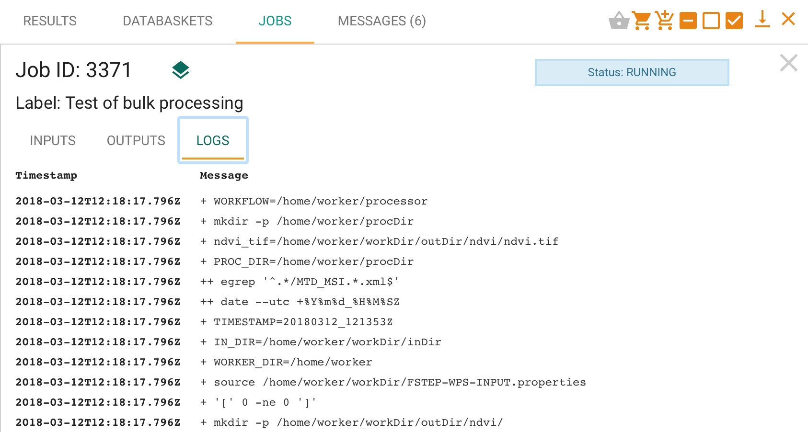

If a service has been run with multiple products (or the service is configured for parallel processing), then the system treats this as a single job with a series of sub-jobs, one for each individual product, as in the figure below.

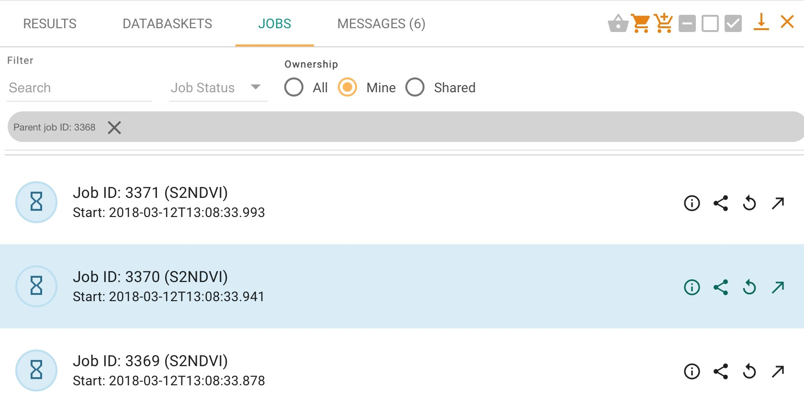

Once a job has finished, the files produced will be listed on the “outputs” tab.

              

* Clicking on the |Layer| symbol will cause the outputs be displayed on the geoserver map, where compatible. (Example shown below.) Results can also be opened using a toolbox
* Clicking on the |Download| symbol will download the outputs to the user’s local machine.

Outputs can also be shared as described in :ref:`managing_and_sharing`.

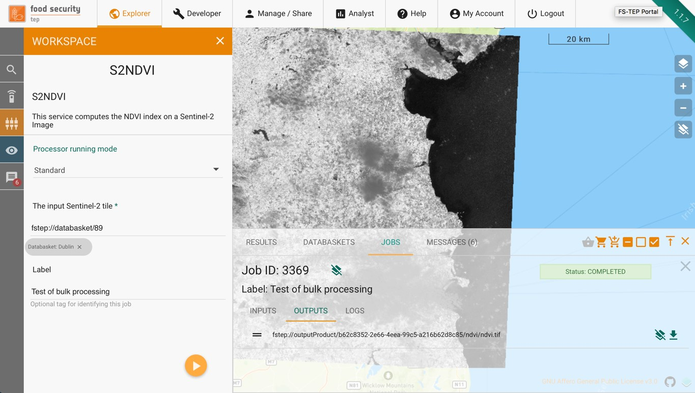
    
Where multiple products have been input, the top-level job will list multiple outputs from the individual sub-jobs, as in the example below

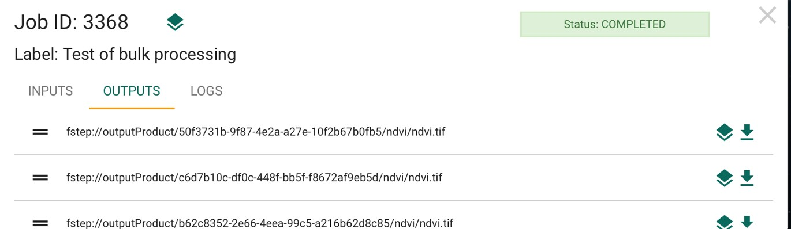
    
.. _using_systematic_processing:

Systematic Processing
---------------------

In addition to the “standard” processing mode the platform also offers the option to perform processing in a systematic mode.

If this is selected, then the workspace of the service changes, so that as well as the input parameters of the selected service (see :ref:`using_services`) the input parameters of satellite data search (:ref:`searching_for_data`) are also listed, as shown in the figure below.

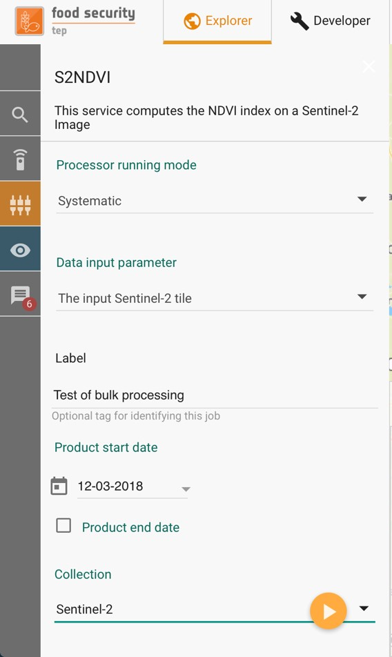
    
For this option, instead of inputting a satellite product (or products) directly the user specifes criteria for the input satellite data, including:

* Satellite Collection.
* Processing level or other specification of the satellite data to use.
* Start and end dates. (The end date is optional.)
* Area of interest.
* Product identifier string.
* Other parameters (e.g. cloud coverage) depending upon the satellite collection.

Once this service is running, the FS TEP system will periodically search for data that matches the criteria. If it finds any, then it will launch a job to process the new data using the specified service, making the output available in the same way as for any other job.

This means that once the job is started, there will first be a bulk processing of any historic data, then periodic processing of any new data that arrives. If an end date is specified then no data will be processed after this date, otherwise the processing will continue.

Note that any processing will be conditional upon the user having a sufficient coin balance. If the user’s balance expires then the processing will be paused, then resume once the balance has been augmented. At the moment the system does not foresee any warning when the user’s balance is about to expire.

.. _using_applications:

Using Applications within FS TEP
--------------------------------

Not all of the services provided process data directly to produce some output, the system also provides the users with various applications that can be used to manipulate data.

The current applications available are listed below, together with links to where there are appropriate tutorials:

**EO Toolboxes**

* **Monteverdi**: https://www.orfeo-toolbox.org/documentation/
* **SNAP**: http://step.esa.int/main/doc/tutorials/snap-tutorials/

**GIS Toolboxes**

* **QGIS**: https://www.qgistutorials.com/en/

**Generic applications also relevant for EO/geospatial analyses**

* **R Studio**: https://www.rstudio.com/
* **Jupyter**: https://jupyter.org/

To start an application, select the application from the services menu, and then drag and drop input data as for any other service. You should also specify:

* A timeout period (default 60 mins)
* A label to identify the job

Pressing the arrow will give a message asking for confirmation to debit coins from your account:

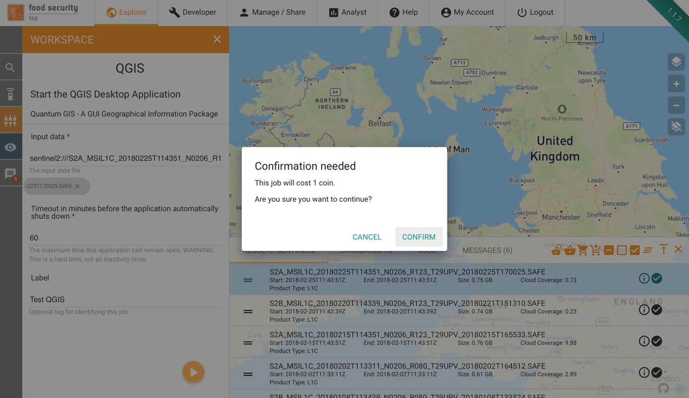

The job will initially appear in the “jobs” part of the data panel as pending:

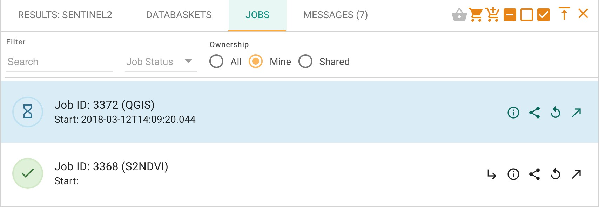

Once the application is ready to be launched, this menu changes as shown below:

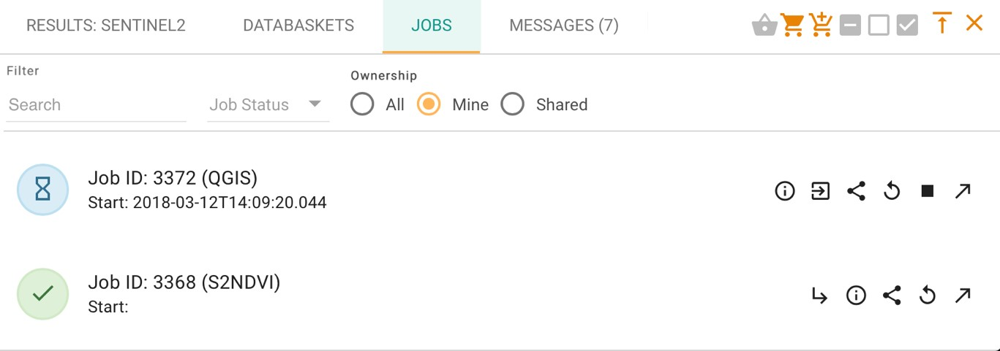

              
Clicking on the |GUI| symbol will open the GUI window in a new tab:

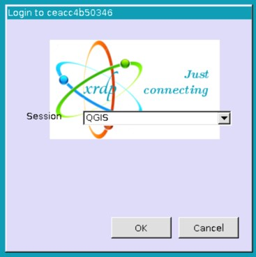

Click OK to start the application:

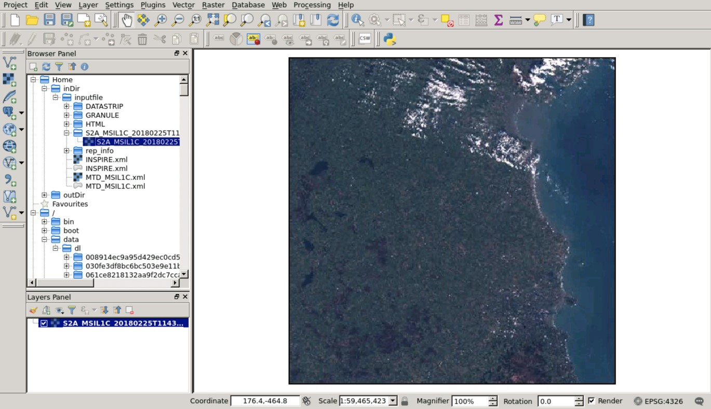

.. _persistent_folders:

Persistent folders
------------------

FS TEP processors and applications run inside Docker containers with ephemeral storage. Processing outputs are collected when the processor/application finishes,
according to the rules defined in :ref:`platform_behaviour_output`.

In some cases, however, it is advantageous to have a persistent folder available in which files can be saved to survive the scope of a single processing.

Some examples are:

* Save some applications customised configuration file to be reused across multiple invocations
* Save some data that will be used multiple times (e.g. a Jupyter notebook)
* Share data between multiple applications (e.g. perform a first level EO data transformation in SNAP and then further process the results in QGIS)

For these use cases, the platform makes available on request the provisioning of a persistent folder for the user.

The persistent folder will be available inside the Docker container at the path /home/worker/workDir/persistentDir/files.
 
See :ref:`frequently_asked_questions` for information on the procedure to request a persistent folder.

