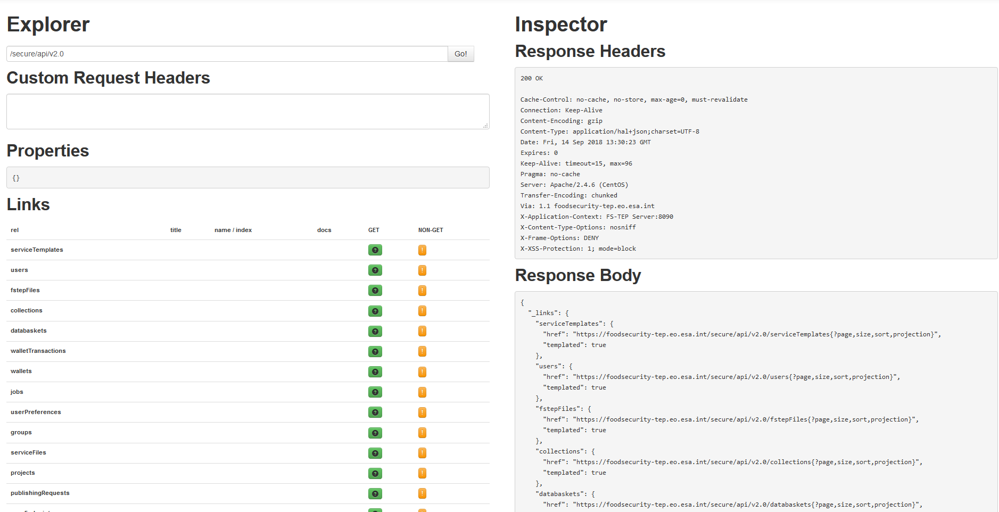

The FS TEP API
==============

About the FS TEP API
--------------------

FS TEP exposes a REST API that allows users to programmatically access the functionalities of the Platform.

Usage of the API is restricted to non administrative users (with roles USER or EXPERT_USER)

Obtaining an API Key
--------------------

The API Key management functions can be accessed through the "My Account" page of the FS TEP Main Platform Interface.

Online API documentation
------------------------

The available API functions are visible in the HAL Browser accessible at https://foodsecurity-tep.net/secure/api/v2.0/

    
Using the API
-------------

The FS TEP API endpoint is https://foodsecurity-tep.net/secure/api/v2.0

To make a call to an API resource, a Basic Authorization Header must be provided containing the API key. This header has the canonical form

"Authorization: Basic <base64 encoded username:apikey>"

**Example: Get a list of the user jobs**

The following curl command will return a JSON description of the processing jobs visible by the user:

curl -H "Authorization: Basic <base64 encoded username:apikey>" https://foodsecurity-tep.net/secure/api/v2.0/jobs
