.. _managing_and_sharing:

Managing and Sharing
====================

This section gives an overview of the functionalities available via the **Manage/Share** tab.

About Managing and Sharing
--------------------------

The figure below shows an overview of the Manage/Share tab:

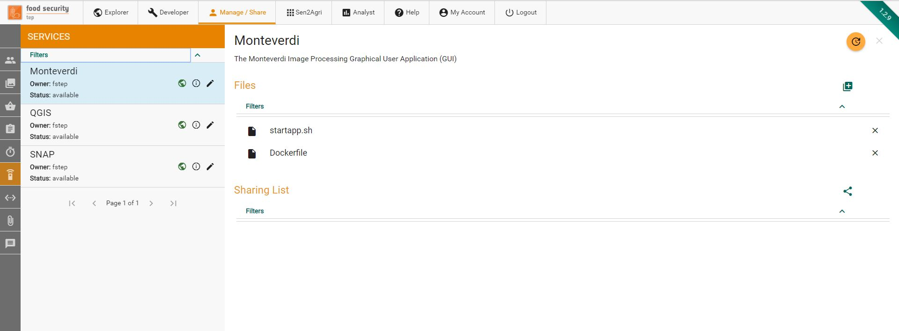
    
Along the left of the screen there is a menu showing the various options available:

|Groups| Set up and control groups, i.e. different access lists. See :ref:`managing_and_sharing_groups`

|Collections| Set up and control access to collections of data. See :ref:`managing_and_sharing_collections`

|Databasket| Control access to databaskets. See :ref:`managing_and_sharing_databaskets`

|Jobs| Control access to processing jobs and their outputs. See :ref:`managing_and_sharing_jobs`

|Systematic-Processing| Control access to systematic processings. See :ref:`managing_and_sharing_systematic_processings`

|Services| Control access to services. See :ref:`managing_and_sharing_services`

|Files| Upload and control access to files. See :ref:`managing_and_sharing_files`

|Messages| Shows the system messages to the user.

.. _managing_and_sharing_groups:

Managing Groups
---------------

The first step in controlling access is to set up a group, i.e. a set of users who will be granted access to data, service, etc. 
To set up a new group, select the |Groups| item on the manage/share tab, then |Add|. 
This gives a popup window as shown below:

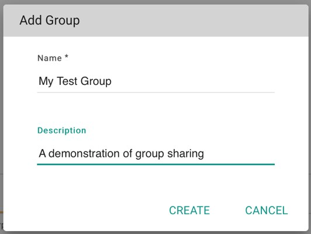

Once the group has been created it will be shown on the manage/share interface:

.. image:: images/manage-03.jpg
    :scale: 50%

To add a new user to this group, press the |New-User| symbol, start typing the user name you want to add, then select the correct user from the popup list and press “ADD”.

Groups allow sharing of other things, including of groups themselves (e.g. to share the management of a group with a subset of the group as a whole).

To share a group, press the |Share| symbol then choose the group that you wish to share it with  (usually but not always the same as the group you are sharing) and the level of access granted (read, write, admin).

.. _managing_and_sharing_collections:

Managing Collections
--------------------

A collection is a set of data grouped together in order to ease searching and sharing.

To create a new collection, select the |Collections| item in the manage/share interface, then |Add|. 
This gives a popup window as shown below:

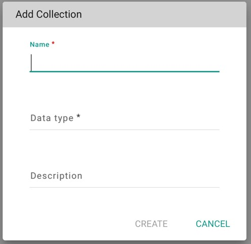
    
Once created this collection appears in the manage/share tab as shown below:

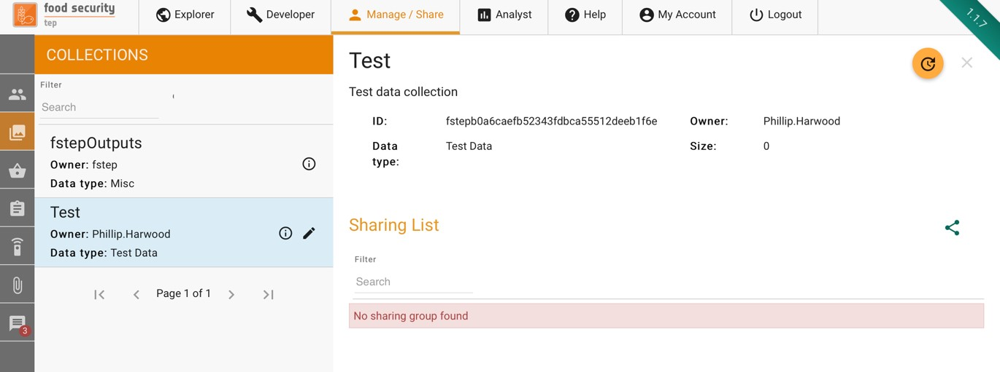

To share a collection, press the |Share| symbol then choose the group that you wish to share it with and the level of access granted (read, write, admin).

.. _managing_and_sharing_databaskets:

Managing Databaskets
--------------------

Databaskets are used to group search results together to facilitate sharing and bulk processing. They have already been discussed in section 2.3. Databaskets can also be added and edited from the manage/share interface.

To create a new collection, select the |Databasket| item in the manage/share interface, then |Add|. This gives a popup window to add the name and description.

Once created, a databasket appears in the manage/share interface as shown below. The user can:

* Add or clear individual files from the databasket
* Share the databasked with a group. To share, press the |Share| symbol then choose the group that you wish to share it with  and the level of access granted (read, write, admin).

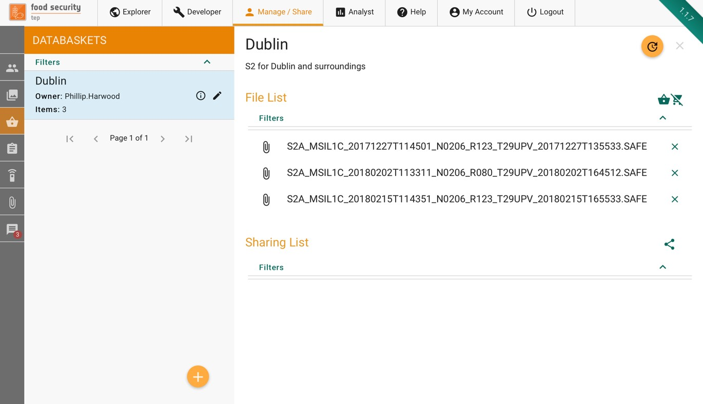

.. _managing_and_sharing_jobs:

Managing Jobs
-------------

Clicking on the |Jobs| item in the manage/share interface will show the user’s processing jobs, as shown below.

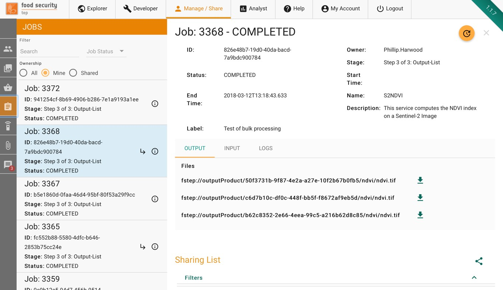

To share the job and its output, press the |Share| symbol then choose the group that you wish to share it with  and the level of access granted (read, write, admin).

.. _managing_and_sharing_systematic_processings:

Managing Systematic Processings
-------------------------------

Clicking on the |Systematic-Processing| item in the manage/share interface will show the user’s systematic processings, as shown below.

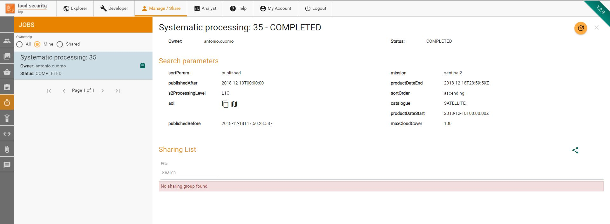

.. _managing_and_sharing_services:

Managing Services
-----------------

Clicking on the |Services| item in the manage/share interface will show will show a list of services available to the user, including their own:

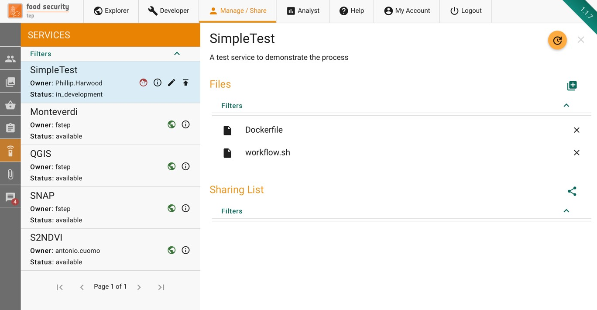

For advanced users who have write or admin access to a service, this tab will show the files which comprise the service.

To share a service, press the |Share| symbol then choose the group that you wish to share it with and the level of access granted (read, write, admin).

.. _managing_and_sharing_files:

Uploading and Managing Files
----------------------------

Clicking on the |Files| item in the manage/share interface will show a list of the users files. New files can be added by selecting the  button to get a popup as shown below.

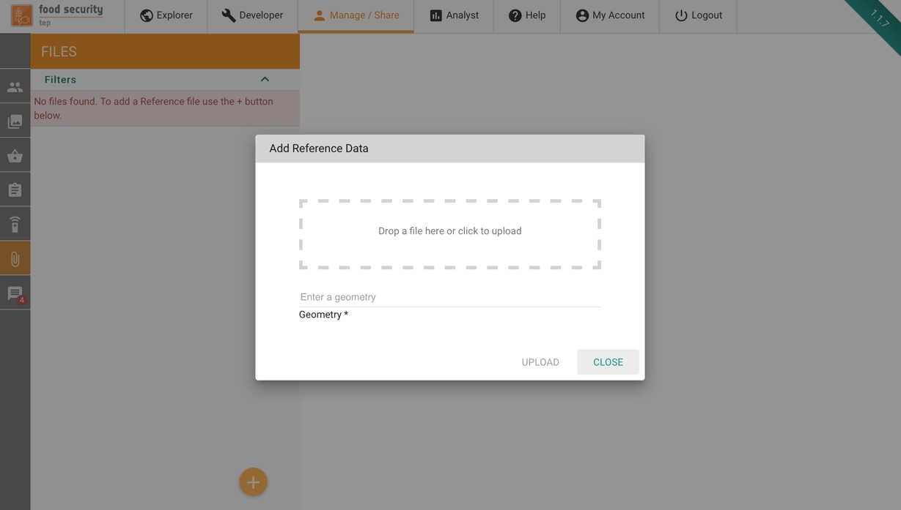

User can upload GeoTiff, Shapefiles or other files.

For GeoTiff, the geometry is automatically extracted from the file and inserted in the platform metadata catalogue.

For Shapefiles, the geometry is automatically extracted from the file and inserted in the platform metadata catalogue..If the resulting geometry has less than 10.000 points, it is preserved as it is, otherwise only the bounding box is saved (in the metadata catalogue, the original file is preserved as it is in storage).

For other files, a WKT geometry can be optionally specified.

For all these tipologies, users can optionally specify a description and start/end dates of the data inside the file. All these data will be saved as file metadata.

Once uploaded, to share a file press the |Share| symbol then choose the group that you wish to share it with  and the level of access granted (read, write, admin).

Publication Requests
--------------------

Publication Requests allow to submit a request to the Platform Content Authority to make publicly available some content.

Currently, publication requests can be submitted for the following artifacts:

* Services
* Service Templates
* Collections

The publication request can be submitted by clicking on the up arrow in the Manage/Share section for the corresponding artifact ( see screenshot below for an example of the collection request button)

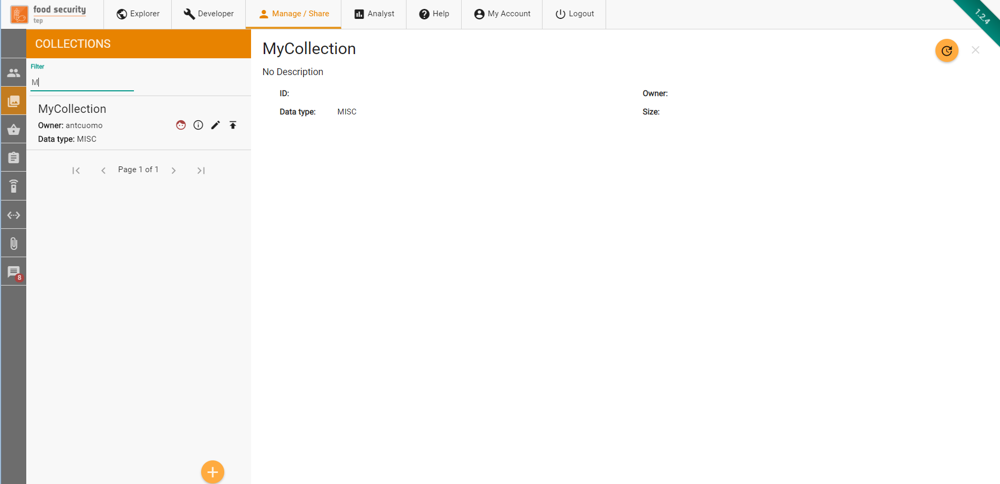

.. _managing_resource_costs:
    
Managing resource costs
---------------------

The Content Authority can set the cost of services and collections. 

              
The cost of the resource can be changed by clicking on the |Coins| icon in the Manage/Share section for the corresponding artifact (see screenshot below for an example of the service cost button)

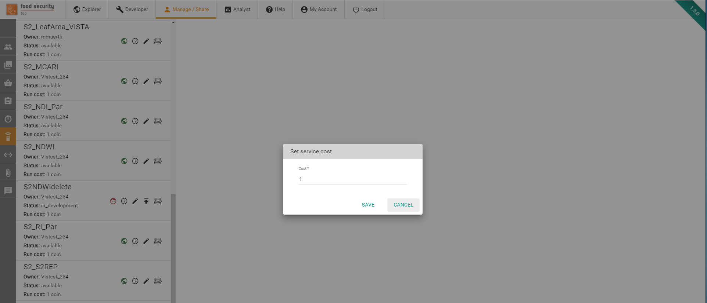

