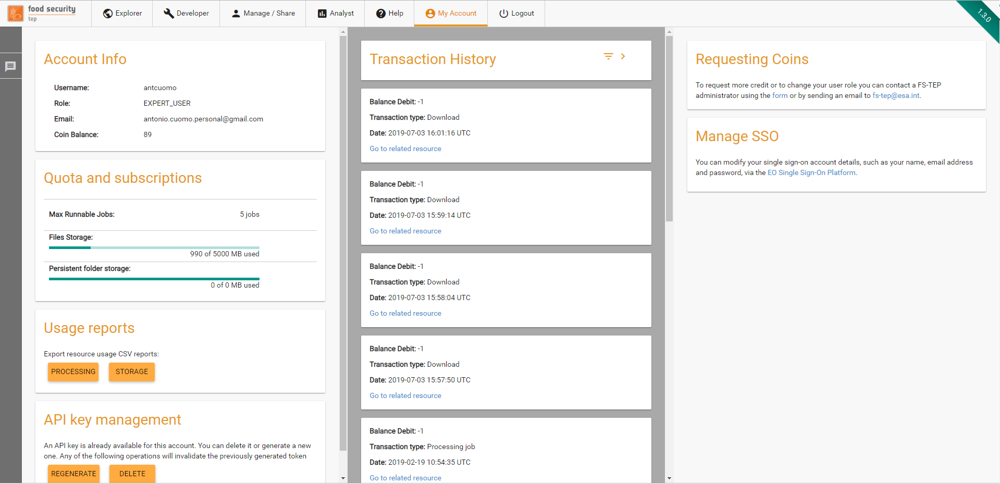
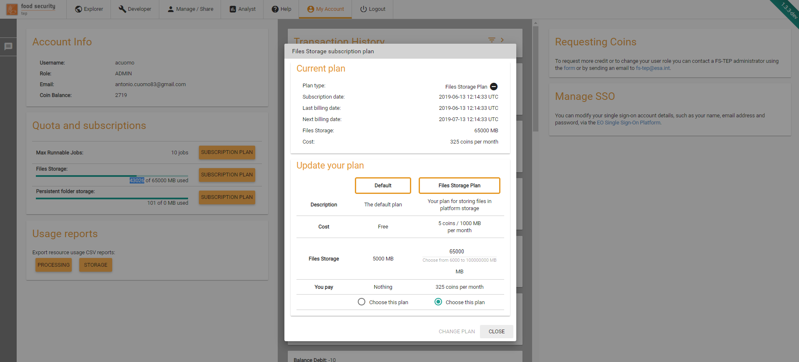
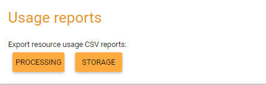
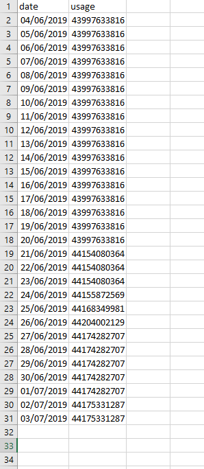

.. _my_account:

My Account
=================

The "My Account" tab
--------------------

The “My Account” tab provides the user with the following information

* The username (and associated email) used to access the site.
* The user’s role (basic user, expert user, administrator, etc)
* A link to the account management of the EO SSO account
* The current balance of TEP coins, and a link to where more can be requested.
* The transaction history, showing the TEP coin usage over time, which can be filtered by the type of transaction and the date
* The Quota and Subscriptions panel
* The Usage Reports panel
* The API key management panel

 
.. _my_account_use_tep_coins: 
 
Use of TEP Coins
----------------

Although users may freely browse data and outputs on the site, to run a process or to download data requires them to have a sufficient TEP coin allocation.

At the current stage of the FS TEP project, TEP coins are not used for billing but as a means to enforce a fair-use policy. Coins may be requested at any time by emailing the project’s helpdesk at fs-tep@esa.int.

Users will be initially assigned a small number of coins to allow them to investigate the system, then if the user requires more coins (e.g. to do a batch processing) this will be agreed with the project on a case by case basis.

API Key Management
------------------

Under API key management, users can

* Generate an API Key for the first time
* Delete an existing API Key
* Regenerate an existing API Key (effectively replacing the previous one)

For security reasons, when a key is generates, it is shown only once to the user to take note of it.

.. _quota_subscriptions:

Quota And Subscriptions
-----------------------

Under Quota and Subscriptions, users can check their usage/limits for different kind of resources and subscribe 

Usage and limits
^^^^^^^^^^^^^^^^

Currently, the platform manages quota for the following resources:

* **Max runnable jobs**: This determines the number of user jobs that are allowed to be processed in parallel in the platform. Jobs exceeding this quota will need to wait until other jobs from the same user terminate.
* **Files storage**: This limits the cumulative size of files that user can store on the platform, either as result of job processing activities or as reference data. 
* **Persistent folder storage**: This determines the maximum size of the persistent folder that user can make use of in processing activities. 

Subscriptions
^^^^^^^^^^^^^

For each quota element for which there at least a subscription plan available, the platform will display a subscription plan button. By clicking on this button, the subscription panel will open.

    
In this panel, user are able to create a new subscription, disable the automatic renewal of existing subscriptions or change their subscriptions quantity/plan. 

In case of a subscription downgrade, the changes will be applied at the end of the current billing period. 

In case of a subscription upgrade, the changes will be applied immediately and the platform will only charge the difference between the old subscription cost and the new subscription cost for the rest of the subscription period.
 

**Note: Subscription plans have not yet been published to the operational platform, so this feature is currently not visible in that environment.**

.. _usage_reports:

Usage Reports
-------------

With these controls, user can request to download CSV reports of their platform usage. Two different reports are currently provided: processing and storage usage. 
Each report can be generated for a maximum of 1 month.

 
A sample of storage usage report is provided in the following image, as opened in Microsoft Excel.

    
     
