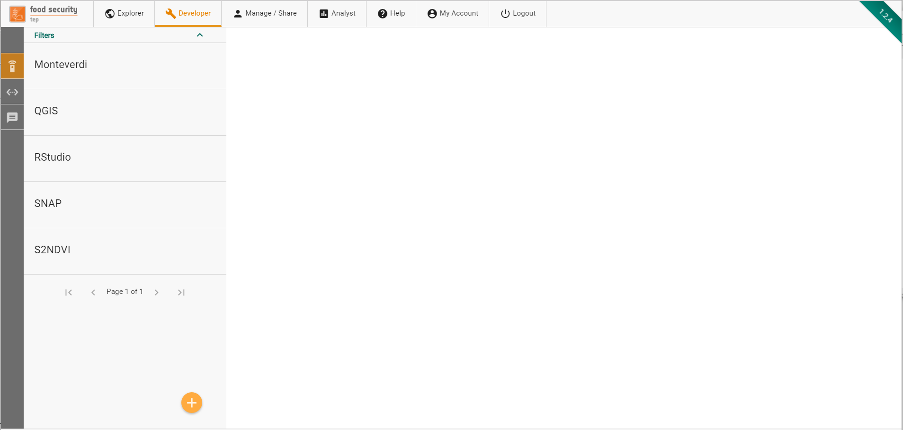
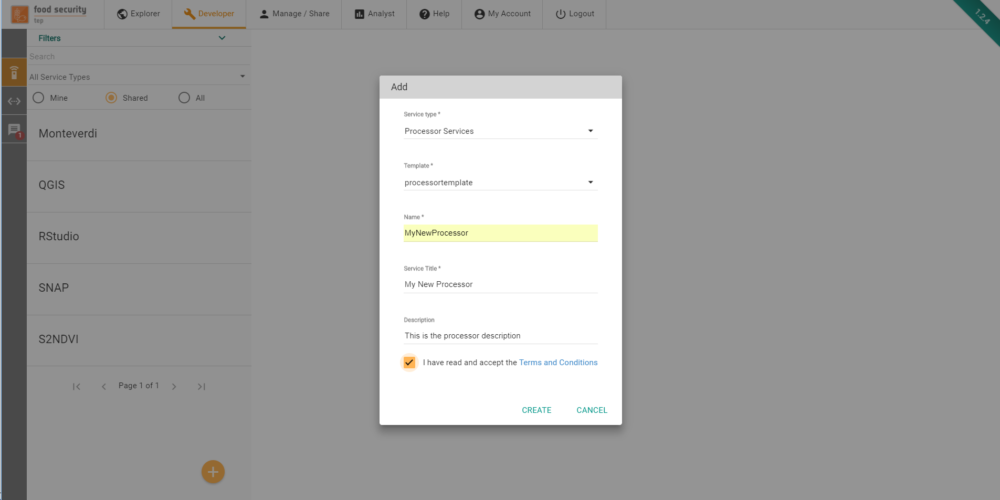
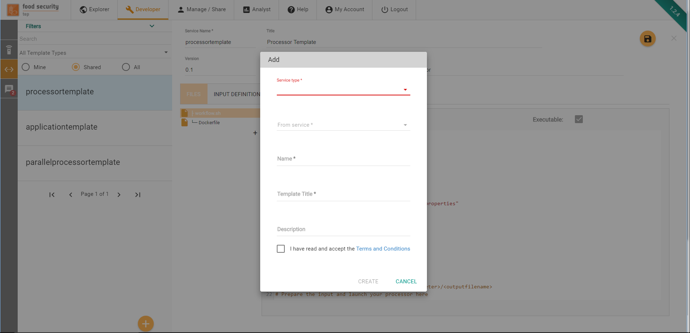
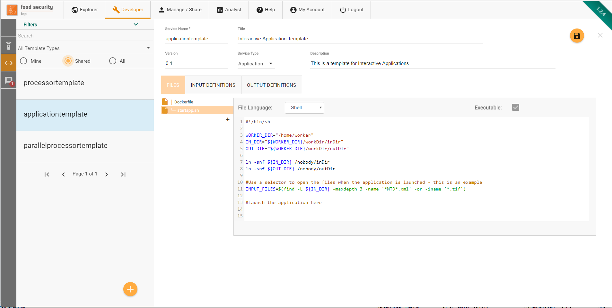
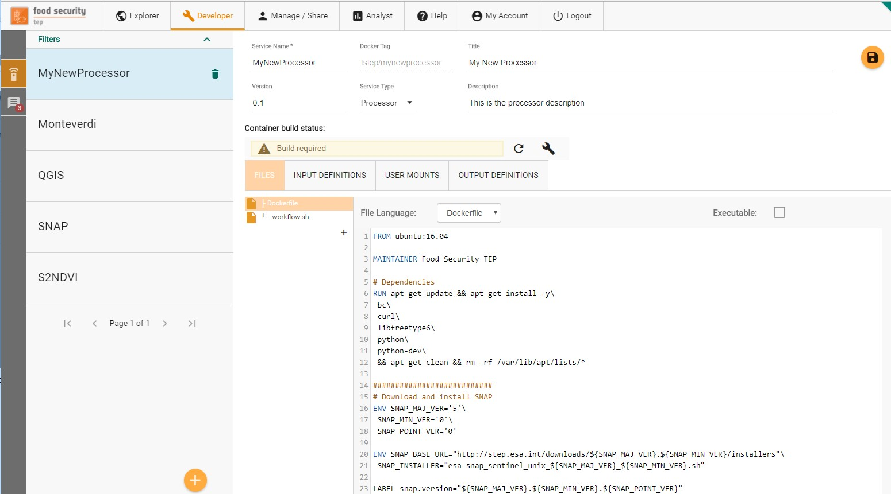
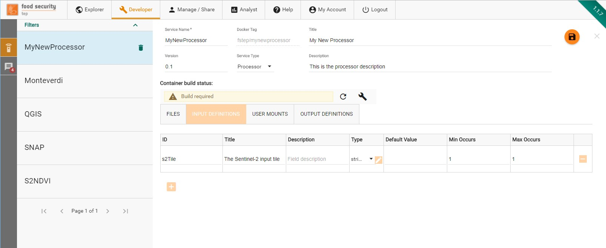
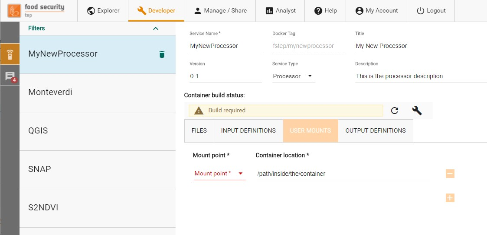

.. _service_development:

Service Development
===================

The Developer Tab
-----------------
The developer tab – only available to expert users – allows to:

* Create and edit services, including new processors and applications. 
* Create and edit service templates.

The figure below shows how the developer tab initially appears.

The tab presents a list of available services and a side toolbar to create new services and service templates.

Creating a new service
----------------------
FSTEP Services are packaged and deployed within Docker containers (www.docker.com). Using the Add button at the bottom of the left sidebar, users can start defining their own services.

In order to create the service, the following information must be provided:

* **Service Type.** The type of service to be created (see :ref:`service_metadata` for details)
* **Template.** The template to be used to bootstrap the service with an initial specification and set of files
* **Name.** The service name. It has to start with a letter, and only contain letters and numbers. No spaces or special characters allowed.
* **Title.** This can be used to give a user friendly name to the service
* **Description.** Here the developer can provide a longer, natural language description of the service.
* **Terms and Conditions.** By ticking this mandatory box, the developer accepts the terms and conditions that govern the integration of the service on the platform (link to the full T&C is provided).

On the next screen, the user can start defining the service specification.

Creating a new service template
-------------------------------
FSTEP Services Templates are partial specification of services that can be used as blueprints 
to create new services. Using the Add Template button at the bottom of the left sidebar, users 
can start defining their own service templates.

In order to create the service template, the following information must be provided:

* **Service Type.** The type of service template to be created (see :ref:`service_metadata` for details)
* **From service.** The template can be initialized with the content of an existing service or from scratch (in which case None must be selected here) to be used to bootstrap the service with an initial specification and set of files
* **Name.** The service template name. It has to start with a letter, and only contain letters and numbers. No spaces or special characters allowed.
* **Title.** This can be used to give a user friendly name to the service template
* **Description.** Here the developer can provide a longer, natural language description of the service template.
* **Terms and Conditions.** By ticking this mandatory box, the developer accepts the terms and conditions that govern the integration of the service template on the platform (link to the full T&C is provided).

On the next screen, the user can start defining the service template specification.

    
.. _service_specification:

Service Specification
---------------------

On the next screen, the user can start defining the service specification.

A service specification is composed of several elements.

* The **Service Metadata** describe properties of the service (including its name, title, description, version and service type).
* The **Files** tab allows the creation of the files that compose the service
* The **Input Definitions** tab is used for the specification of the service inputs
* The **Output definitions** tab is used for the specification of the service outputs
* The **User Mounts** tab allows to specify mounts (i.e. folders of data) that should be made available to the service Docker container at runtime
* The **Container build** is used to manage the underlying Docker container image

.. _service_metadata:

Service Metadata
^^^^^^^^^^^^^^^^

In the top fields, the service metadata (name, title, description) plus the additional version field can be edited. The Docker Tag that is associated to the service is immutably generated on service creation. 
The Service Type field can be used to change the service type. The possible values are

* **Application**: An application is a service that requires user interaction. This kind of service is typically used to provide a service with a GUI or Web UI. The service execution is not bound to terminate when the end of its entry point (see more below) is reached.
* **Processor**: A processor is an algorithm that is executed without user intervention. Processors start with a user specified entry point script and terminate when this script terminates. The execution of a processor will trigger the creation of a processing job.
* **Bulk Processor**: A bulk processor is a specialization of a processor that will automatically make the processor outputs visible by all users in the search interface.
* **Parallel Processor**: A parallel processor is able to trigger more instances of the processor based on an input with a multiplicity higher than 1 (e.g. a databasket or a list of input files). The execution of a parallel processor triggers the creation of a parent job and as many child job as the number of inputs provided for the execution. The parallel processor must identify a specific input parameter that will receive the different instances of the multiple input. The other input parameters will be passed unchanged to all the processing job generated. More on this in section.

The Files Tab
^^^^^^^^^^^^^

Through the Files tab, users can create the different files that compose the processing service. A minimum of two mandatory files must be specified:

* **A Dockerfile** is a text document that contains all the commands a user could call on the command line to assemble an image.
* **An entrypoint**, referenced in the Dockerfile through the ENTRYPOINT instruction, defines where the execution of the container starts at runtime. A default Bash entrypoint called workflow.sh (or “startapp.sh” in the case of an application) is provided by the platform as a template when the processor is created. The developer is free to change the entrypoint with any other script.

The Files Tab also provides the Code Editor, where the user can create the content of the file supported by a syntax highlighting feature for his language of choice.

If the file to be created is supposed to be executable, the “Executable” checkbox should be ticked.

The interface supports the specification of text files. Any binary file should instead be managed through the Dockerfile, e.g. by installing or downloading binary files available at external sites.

The Input Definitions Tab
^^^^^^^^^^^^^^^^^^^^^^^^^
Through the input definition tab, the developer specifies of the service will interact with the platform to get its input.

For each input managed by the service, the developer has to enter a definition that includes:

1. The input id, a string used to identify the input inside the service (see below).
2. The input title, a human readable name for this input.
3. The input description, a longer natural text description of this input , used on the workspace panel.
4. The input type, which can be:
    a. A literal value, i.e. a string, integer or double
    b. A complex value, defined by a complex MIME type and an extension.
5. The input default value, used when no value is provided by users when the service is launched
6. The input minimum occurrences. A minimum occurrence of 0 indicates this input parameter is optional. A minimum occurrence of 1 or more indicates this input parameter is mandatory.

The platform behaviour for input
^^^^^^^^^^^^^^^^^^^^^^^^^^^^^^^^

The FS TEP platform will behave as follows with respect to service inputs:

1. Any integer, double or simple string that is expected by a service will be delivered to its container in the form of a file (/home/worker/workDir/FSTEP-WPS-INPUT.properties) containing a line for each input in the form ID=VALUE.

**Example**

The developer defines an input with ID “rounding” of type double. A user invokes this service passing as arguments (through the GUI or through the API) the value 0.5. The platform will create inside the container the file /home/worker/workDir/FSTEP-WPS-INPUT.properties with the following content:

rounding=0.5

By reading this file, the service can then use the provided value as part of its computation. In a Bash script, this file will typically be read with the source command so that after the execution of that command all the input IDs and values will be available as environment variables. 

2. For any string that is an URI of a platform managed resource, the platform will place the resource content in a subfolder of /home/worker/workDir/inDir having the input ID as name.

**Example**

The developer defines an input with ID “s2tile” of type string. A user invokes this service passing as arguments (through the GUI or through the API) the value

sentinel2:///S2A_MSIL1C_20180312T124041_N0206_R052_T26SNE_20180312T125451.SAFE

The platform will put the Sentinel-2 product corresponding to the above URI in the

/home/worker/workDir/inDir/s2tile

folder in the container.

3. To designate an input parameter as the one that will receive the different input files in a parallel processing, its ID must be named parallelInputs. Inside the processor, this special field must be referenced through the ID input.

**Example**

The developer defines an input with ID “parallelInputs” of type string. A user invokes this service passing as arguments (through the GUI or through the API) a data basket.

The platform will create n jobs, each one with an item from a databasket that will be available in the

/home/worker/workDir/inDir/input

folder in the container.

The Output Definitions Tab
^^^^^^^^^^^^^^^^^^^^^^^^^^

The output definition tab defines how the service will interact with the platform.

For each output managed by the service, the developer has to enter a definition that includes:

1. The output id, a string used to identify the output inside the service (see below).
2. The output title, a human readable name for this output.
3. The output description, a longer natural text description of this output
4. The output type, which can be:
    a. A literal value, i.e. a string, integer or double
    b. A complex value, defined by a complex MIME type and an extension.
5. The output default value, used when no value is provided by service for that output.
6. The output time regular expression, used by the platform to extract output timestamp metadata from the output file name, including start and/or end timestamps of the output product. 
7. The output minimum occurrences. A minimum occurrence of 0 indicates this output parameter is optional. A minimum occurrence of 1 indicates this output parameter is mandatory

**Time Regular Expression**

The time regular expression describes how the timestamps should be extracted from the file name. It does so by leveraging named groups in the regexp. The supported named groups are:

* ?<start> for a group that represents the product start date
* ?<end> for a group that representes the product end date
* ?<startEnd> for a group that represents both the product start and end date.

The supported date and time format is "yyyyMMdd[[ ]['T']HHmm[ss][.SSS][XXX]]" which can be interpreted as:

A mandatory year/month/day date with four digits for year, two for month and two for day followed by an optional time composed of 

* An optional space followed by
* An Optional T symbol followed by 
* Mandatory Hour and minutes fields followed by 
* Optional seconds specification followed by 
* Optional milliseconds specification followed by
* Optional Timezone. 

If not time is specified, Midnight UTC is assumed. 

If no time zone is specified, UTC is assumed. 

**Example 1**

An NDVI service produces files that observe the convention S2_NDVI_yyyyMMdd.tif, where there is a single timestamp representing the product start and end time.

The developer should add a timeRegexp expression of the form:

"S2_NDVI_(?<startEnd>\d{8}).tif" 

so that the platform will be able to extract from the file name and parse the corresponding timestamp (in this case, a date without a time) to represent the product start and end time.

**Example 2**

A change detection service produces files that observer the convention S2_CHD_yyyyyMMddThhmm_yyyyyMMddThhmm.tif, where the first block represents the time of the first image and the second block represents the time of the second more recent image

The developer should add a timeRegexp expression of the form:

"S2_NDVI_(?<start>\d{8}T\d{4})_(?<end>\d{8}T\d{4}).tif" 

so that the platform will be able to extract from the file name and parse the two corresponding timestamps (in this case, dates with a time) to represent the product start and end time.

.. _platform_behaviour_output:

The platform behaviour for output
^^^^^^^^^^^^^^^^^^^^^^^^^^^^^^^^^

The FS TEP platform will behave as follows with respect to service outputs:

1. If a folder with the same name as an output id is defined inside the /home/worker/workDir/outDir folder, the content of that folder is saved as the service output for that id.
2. If a file inside the folder is of a type supported by the geometry extractor, geometry information are saved as part of the output metadata. Currently, the supported file type is GeoTiff.
3. If a time regular expression is defined for that output, the start and/or end timestamps are extracted from the file name and saved as part of the output metadata.

The User Mounts Tab
^^^^^^^^^^^^^^^^^^^

The platform allows to mount folders containing existing data inside the service containers. This mechanism can be used to provide folders with auxiliary data to the processor. 
At the current stage, to request the availability of a folder with some data, the developer has to contact the platform support to set up the data that must be provided inside that folder. 
Once the mount has been defined, the developer can define autonomously in which container folder this content has to be mounted.

The Container Build
^^^^^^^^^^^^^^^^^^^

The container build widget informs the developer about the status of the service Docker image. The following statuses are defined:

* **Build required**: The service Docker image has never been built or the service files have been modified after the last build. In this case, the developer can launch a new build by clicking on the wrench icon.
* **Build running**: The last build launched by the developer is still running.
* **Build completed**: The last build has been completed and the service files are in sync with it.

Service templates specification
-------------------------------

On the next screen, the user can start defining the service templates specification.

    
A service template specification is a partial version of a service specification. It includes the following subset of elements from service specification

* The **service metadata** describe properties of the service (including its name, title, description, version and service type).
* The **Files tab allows** the creation of the files that compose the service
* The **Input Definitions** tab is used for the specification of the service inputs
* The **Output definitions** tab is used for the specification of the service outputs

Please refer to the :ref:`service_specification` page for a description of these elements.
